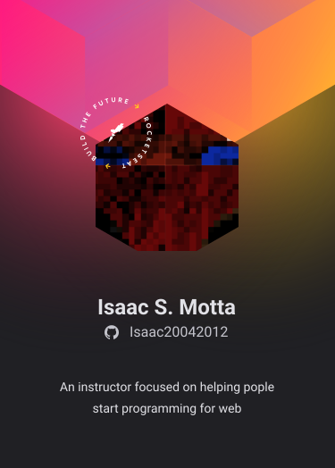

## Olá! Eu sou o Isaac 🚀🚀

- 🔭 Atualmente estou trabalhando com HTML e CSS
- 🌱 Atualmente estou aprendendo JS
- ⚡ Curiosidade: React Native


[](https://www.youtube.com/channel/UC-E3dJ4KL3dJigDV30DwCbg)


<div>
    
    
    
</div>

- [x] Aprender HTML
- [x] Aprender CSS
- [ ] Aprender JS

``` JS
    let person = {
        name: "isaac",
        isHuman: true
    }
```
